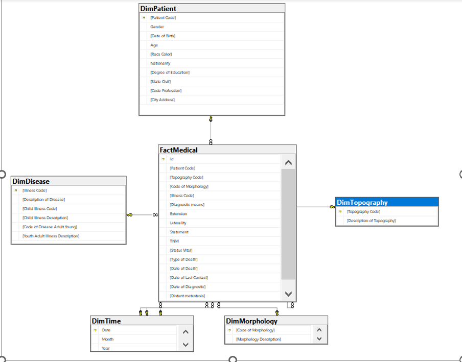

# Building and analyzing a cancer data warehouse in Brazil
## Introduction
•	Tên Dataset: Cancer Data Brazil
•	Link Dataset: Cancer Data Brazil | Kaggle
•	Mô Tả: Dữ liệu này là tập hợp thông tin về bệnh ung thư ở các bệnh viện tại Brazil từ năm 2000 đến năm 2019. Dữ liệu này bao gồm các thông tin về bệnh nhân, bao gồm tuổi, giới tính và vị trí địa lý của bệnh viện, các thông tin về loại ung thư, phương pháp chẩn đoán và điều trị, và các chỉ số sức khỏe của bệnh nhân. Tập dữ liệu này hoàn toàn do  Viện Ung thư Quốc gia INCA tạo ra và dữ liệu này phù hợp với luật pháp khu vực và có thể được yêu cầu bởi bất kỳ ai.
•	Kích thước: 
o	Với caner_data_eng có 38 thuộc tính với 1.048.574 dòng
## Lượng đồ hình sao

Based on the Data we collected we decide to devide our data into seven Dimentions
+ DimPatient
+ DimDisease
+ DimTime
+ DimMorphology
+ DimTopography
+ FactMedical
